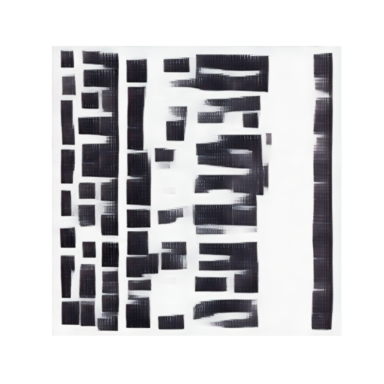

# Coding Two - Final Project  
Author: Fan Yang  

The codes are adapted from [DCGAN](https://git.arts.ac.uk/rfiebrink/ExploringMachineIntelligence_Spring2022/blob/main/week5/dcgan.ipynb) and [Fast Style Transfer for Arbitrary Styles](https://github.com/ual-cci/MSc-Coding-2/blob/master/Week-7-notebooks/tf2_arbitrary_image_stylization.ipynb)  

<table>
<tr>
 <td>
  
 </td>
 <td>
  
 </td>
</tr>
</table>

The project chains the DCGAN model with the Fast Style Transfer model. The DCGAN model trained on MNIST generates a sequence of images and then feed into the Style Transfer model. The method was inspired by the Helena Sarin's blog post on [GANstruction](https://thegradient.pub/playing-a-game-of-ganstruction/), aims to experiment the model on simple shapes and colours to create interesting effects.  

[Colab Notebook](https://github.com/Yangffffffff/coding-two-final-project/blob/main/Fast_Style_Transfer_and_DCGAN.ipynb)  

  

https://user-images.githubusercontent.com/91968054/175397426-f5a85f1e-ba1d-47f9-b7ad-81514bf925a3.mp4

